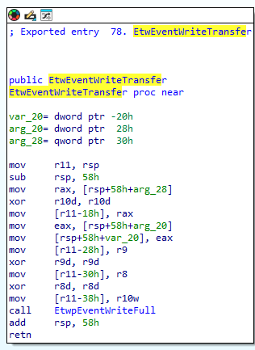

# Stealthy ETW Patch

A proof-of-concept tool that demonstrates ETW (Event Tracing for Windows) evasion by patching the `EtwpEventWriteFull` function in memory. This technique prevents ETW from logging events by making the function return immediately.

## Technique Overview

The tool works by:
1. Locating `ntdll.dll` in memory
2. Finding the `EtwEventWriteTransfer` or any other function that uses `EtwpEventWriteFull` using `GetProcAddress`
3. Searching for the internal call to `EtwpEventWriteFull` and calculates it's address like that:
```
baseAddressOfExportedFunction + i(call instruction offset) + 5(call instruction with argument) + relativeOffset(call argument)
```
4. Patching at found address with an early RET instruction (0xC3)


###Compilation
```bash
gcc .\stealthy_etw_patch.c -o .\stealthy_etw_patch.exe -ldnsapi
```

## Usage

Run the compiled executable with administrator privileges:
```bash
.\stealthy_etw_patch.exe
```

The program also test the technique by using DnsQuery_A which can later be examined using the `Microsoft-Windows-DNS-Client` ETW provider(e.g Sysmon)

## Knowledge
### Main ETW functions using internal EtwpEventWriteFull function


